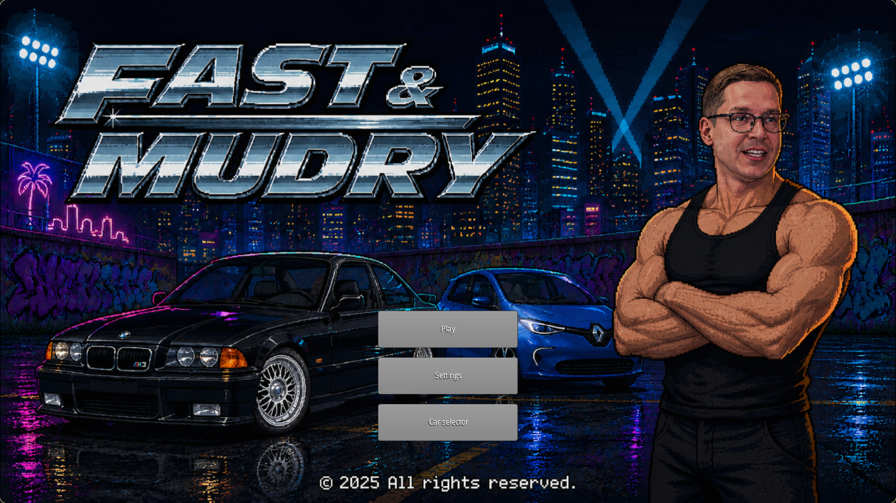
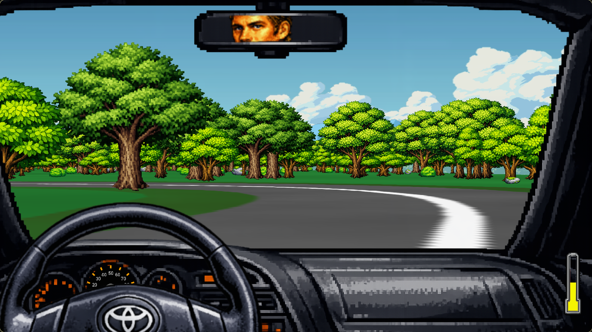
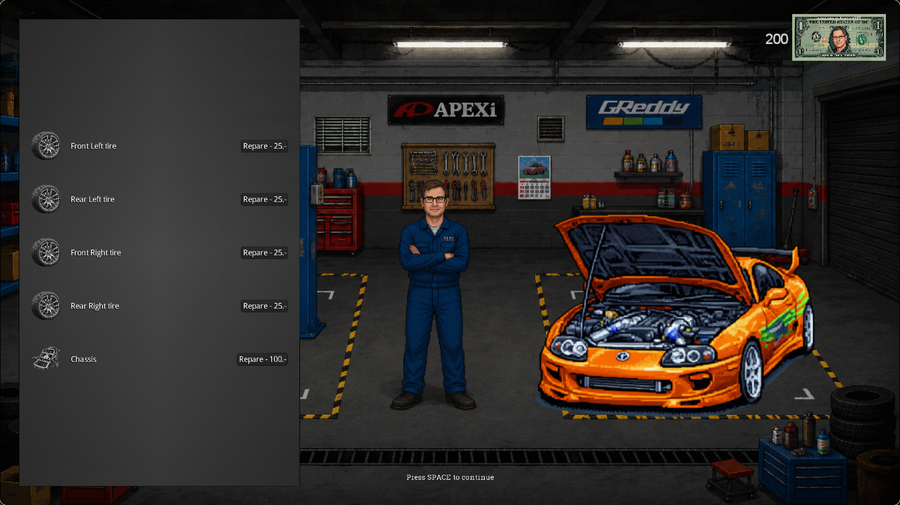
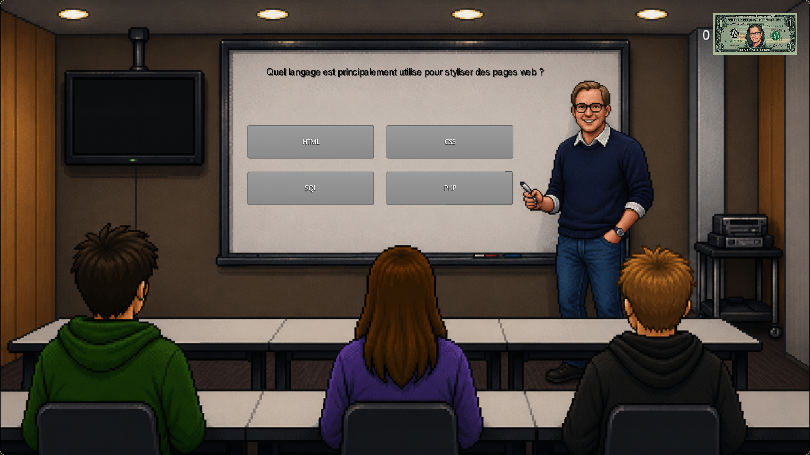

# Fast & Mudry

Fast & Mudry est un petit jeu de course en pseudo-3D (effet "Mode 7") fait en Scala avec la librairie gdx2d.
Le but c'est de traverser plusieurs jours de conduite à travers différents biomes, sans casser sa voiture, et d'arriver jusqu'au bout.

## Screenshots

*L'écran du menu principal avec le logo et les boutons.*

*En pleine course dans le biome forêt, avec le HUD et le compteur de vitesse.*

*Le garage, ou on répare la voiture entre deux journées.*

*Le quiz qui permet de gagner des pièces.*

## Vidéo de gameplay

Une petite vidéo de gameplay :

## Installation et lancement

Le projet utilise **Scala 2.13** et la librairie **gdx2d** (le `.jar` est déjà fourni dans le dossier `libs/`).

Prérequis :

- Le JDK semeru-1.8
- Le SDK Scala 2.13

Le plus simple c'est de le lancer depuis IntelliJ IDEA :

1. Ouvrir le projet dans IntelliJ.
2. Vérifier que le JDK est bien réglé sur semeru-1.8
3. Installer les librairies du dossier `libs/` en les ajoutant au projet
4. Définir le dossier `src` comme dossier source (clic droit sur `src` > *Mark Directory as* > *Sources Root*), et lui mettre `ch.hevs.fastandmudry` comme **préfixe de package**.
5. Lancer la classe principale `ch.hevs.fastandmudry.Launcher` (fichier `src/Launcher.scala`).

## Manuel du jeu

### Le but du jeu

Tu joue un élève qui doit traverser 3 journées de conduite, chacune dans un biome différent :

- **Jour 1** : la forêt
- **Jour 2** : le désert
- **Jour 3** : la neige

Chaque journée, tu conduit jusqu'à la ligne d'arrivée. Entre les courses il y a une petite cinématique, un quiz pour gagner des pièces, puis le garage pour réparer ta voiture avant de repartir. Si ta voiture casse complétement pendant la course, c'est game over.

Le piège c'est que la voiture s'abîme : les pneus, le chassis et la température du moteur peuvent poser problème. Faut donc faire attention à la route et éviter de tout taper. Et surtout, chaque biome a sa propre façon de te casser la voiture (voir plus bas).

### Les biomes et leurs pièges

Chaque biome a ses propres obstacles et sa propre manière de t'embêter quand tu sors de la route. Dans tous les cas, rouler hors route te ralentit, mais c'est pas le pire...

#### Jour 1 : la forêt

- Hors route, la vitesse max est divisée par deux.
- Tant que tu roules dans l'herbe, chaque pneu a une petite chance d'**exploser** à tout moment. Et un pneu crevé c'est pas joli :
  - un pneu **avant** crevé, et le volant tire tout seul du côté du pneu mort ;
  - un pneu **arrière** crevé, et ta vitesse max est divisée par deux.
- Les obstacles : les **arbres** cassent le chassis, les **rochers** et les **buissons** bloquent juste le passage (et certains rochers traînent carrément sur la route).

#### Jour 2 : le désert

- Hors route c'est du sable : la vitesse max tombe à 20%, le pire ralentissement des trois biomes.
- Le moteur **surchauffe** dès que tu quittes la route (et il chauffe déjà un peu tout seul en roulant). Si la température atteint **100°**, le moteur lâche et c'est game over direct — ça se répare pas au garage.
- Les obstacles : les **cactus** cassent le chassis, les **rochers désertiques** bloquent le passage, et des **squelettes** décorent les bords de la route.

#### Jour 3 : la neige

- Hors route, la vitesse max tombe à 70% seulement. Plus cool que les autres ? Pas vraiment...
- Dans la neige, les pneus **glissent** : les commandes gauche/droite sont **inversées** tant que t'es hors de la route !
- En plus, le moteur **gèle** hors route (encore plus vite que la surchauffe du désert). Si la température descend à **-100°**, le moteur est mort et c'est game over. Le truc c'est de rester sur la route pour le laisser remonter en température.
- Les obstacles : les **sapins** cassent le chassis, les **rochers enneigés** et les **tas de neige** bloquent le passage.

Petit rappel pour le garage : un pneu se répare pour **25 pièces**, le chassis pour **100 pièces** (un chassis cassé te fait perdre de la vitesse max). La température, elle, se répare pas : faut juste pas pousser le moteur à bout.

### Les contrôles

| Touche | Action |
|--------|--------|
| Flèche haut | Accélérer |
| Flèche bas | Freiner / faire marche arrière |
| Flèche gauche | Tourner à gauche |
| Flèche droite | Tourner à droite |
| ESPACE | Continuer (menus, quiz, garage...) |
| ÉCHAP | Revenir en arrière (selon l'écran) |
| F1 | Écran de debug de la voiture (depuis le menu) |
| F12 | Activer/désactiver le mode debug |

### Comment jouer

1. Depuis le menu, tu peux choisir ta voiture avec le bouton **Car selector** (il y en a plusieurs : BMW, Zoe, Chevrolet, etc.).
2. Clique sur **Play** pour commencer la partie.
3. Conduit jusqu'à la fin de chaque parcours en évitant les obstacles (arbres, rochers, cactus...). Chaque biome a ses propre obstacles et ses propres pièges (voir la section sur les biomes plus haut).
4. Après la course, réponds aux questions du **quiz** : chaque bonne réponse te rapporte des pièces.
5. Au **garage**, utilise tes pièces pour réparer les éléments cassés de ta voiture, puis appuie sur ESPACE pour repartir.
6. Termine les 3 jours pour voir la cinématique finale !

